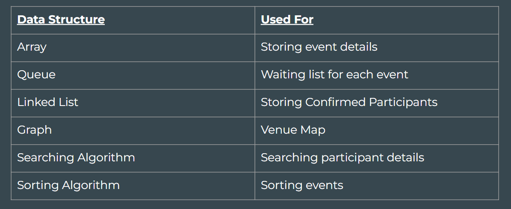

# DSA Project-Event Ticket Management System
## By, Anjalin Jacob (16) and Nida Rahman C (47)
Our project is an Event Ticket Management System developed using C programming language. The main aim of the project is to manage event bookings and demonstrate the practical use of different data structures.
The system allows users to view available events, book tickets, cancel tickets, search for participants, navigate to event venues, and sort events based on ticket availability.




# Queue
A queue is a linear data structure that operates on the First-In-First-Out (FIFO) principle.

In our project, queues are used to manage event waitlists. When an event's tickets sell out, new registrants are placed into a waitlist queue.

We implemented an array-based queue inside each event structure. The enqueue function adds users to the rear of the line, and when a confirmed ticket is cancelled, the dequeue function automatically promotes the user at the front of the queue to a confirmed booking.

```c
void enqueue(Event* ev, int b_id, char* name) {
    if (ev->q_rear == MAX_WAITLIST - 1) {
        printf("\n=> FAILED: Waitlist is completely full!\n");
        return;
    }
    if (ev->q_front == -1) {
        ev->q_front = 0;
    }
    ev->q_rear++;
    ev->waitlist[ev->q_rear].booking_id = b_id;
    strcpy(ev->waitlist[ev->q_rear].name, name);   
    printf("\n=> ALERT: Tickets sold out. Added to waitlist!\n");
    printf("=> Your Registration ID is: %d\n", b_id);
}

WaitlistItem dequeue(Event* ev) {
    WaitlistItem item = {-1, ""}; 
    if (ev->q_front == -1) {
        return item;
    }   
    item = ev->waitlist[ev->q_front];
    ev->q_front++;
    if (ev->q_front > ev->q_rear) {
        ev->q_front = -1;
        ev->q_rear = -1;
    }    
    return item;
}
```
# Linked List
A linked list is a linear data structure where elements (nodes) are stored dynamically rather than in contiguous memory locations.

In our project, we use a singly linked list to track all confirmed participant bookings across all events.

When a user successfully books a ticket, memory is dynamically allocated, and a new node is inserted at the head of the list. We traverse this list to search for specific participant IDs or to remove nodes during the ticket cancellation process.

```c
void confirmBooking(int e_id, int b_id, char* name) {
    Participant* new_node = (Participant*)malloc(sizeof(Participant));
    new_node->booking_id = b_id;
    strcpy(new_node->name, name);
    new_node->event_id = e_id;
    new_node->next = head;
    head = new_node;
}

void displayEvents() {
    printf("\n--- Available Events ---\n");
    for (int i = 0; i < MAX_EVENTS; i++) {
        int waitlist_count = (events[i].q_front == -1) ? 0 : (events[i].q_rear - events[i].q_front + 1);
        printf("ID: %d | %s | Tickets Left: %d | Waitlist Queue: %d/%d\n", 
               events[i].id, events[i].name, events[i].available_tickets, waitlist_count, MAX_WAITLIST);
    }
}
```
```c
void bookTicket() {
    int e_id;
    char p_name[50];    
    displayEvents();
    printf("\nEnter Event ID to book: ");
    scanf("%d", &e_id);
    getchar();     
    int event_index = -1;
    for(int i = 0; i < MAX_EVENTS; i++) {
        if(events[i].id == e_id) event_index = i;
    }  
    if (event_index == -1) {
        printf("Invalid Event ID.\n");
        return;
    }   
    printf("Enter Participant Name: ");
    fgets(p_name, 50, stdin);
    p_name[strcspn(p_name, "\n")] = 0;
    int assigned_id = global_booking_id++;
    if (events[event_index].available_tickets > 0) {
        events[event_index].available_tickets--;
        confirmBooking(e_id, assigned_id, p_name); 
        printf("\n=> SUCCESS: Ticket booked! Your Booking ID is: %d\n", assigned_id);
    } else {
        enqueue(&events[event_index], assigned_id, p_name); 
    }
}
```
```c
void cancelTicket() {
    int b_id;
    printf("\nEnter Booking ID to cancel: ");
    scanf("%d", &b_id);  
    Participant* curr = head;
    Participant* prev = NULL;
    bool found = false;   
    while (curr != NULL) {
        if (curr->booking_id == b_id) {
            found = true;
            break;
        }
        prev = curr;
        curr = curr->next;
    }   
    if (!found) {
        printf("Booking ID %d not found in confirmed tickets.\n", b_id);
        return;
    }    
    int ev_id = curr->event_id;
    if (prev == NULL) head = curr->next;
    else prev->next = curr->next;    
    printf("\n=> CANCELLED: Ticket for '%s' (ID: %d) has been cancelled.\n", curr->name, b_id);
    free(curr);    
    int event_index = -1;
    for(int i = 0; i < MAX_EVENTS; i++) {
        if(events[i].id == ev_id) event_index = i;
    }    
    if (events[event_index].q_front != -1) {
        WaitlistItem next_person = dequeue(&events[event_index]);         
        confirmBooking(ev_id, next_person.booking_id, next_person.name);        
        printf("=> UPDATE: Waitlisted person '%s' (ID: %d) has automatically received the ticket!\n", 
               next_person.name, next_person.booking_id);
    } else {
        events[event_index].available_tickets++;
    }
}
```
# Graph
A graph is a non-linear data structure consisting of vertices and edges. 

In our project, the vertices represent different locations in the event venue and the edges represent paths between them.

We use BFS, or Breadth First Search, to traverse the graph level by level and find a route from the user's starting location to the destination. The graph is represented using an adjacency matrix, and BFS uses a queue to visit the connected locations.

 


```c
void venueBFS(int start, int destination) {
    int visited[VENUE_NODES] = {0};
    int queue[VENUE_NODES];
    int q_front = 0, q_rear = 0;
    printf("\nPath:\n");
    queue[q_rear++] = start;
    visited[start] = 1;
    while (q_front < q_rear) {
        int current = queue[q_front++];
        printf("[%s] ", node_names[current]);        
        if (current == destination) {
            return;
        }
        printf("-> ");
        for (int i = 0; i < VENUE_NODES; i++) {
            if (venue[current][i] == 1 && !visited[i]) {
                queue[q_rear++] = i;
                visited[i] = 1;
            }
        }
    }
}
```
# Searching Algorithm
The algorithm uses linear search to find a participant using their Booking ID.

It first searches the linked list of confirmed participants and, if the participant is not found, it searches the waiting queue of each event. 

This helps determine whether the participant has a confirmed ticket or is on the waiting list. 
```c
void searchParticipant() {
    int search_id;
    printf("\nEnter Booking ID to search: ");
    scanf("%d", &search_id);
    Participant* temp = head;
    while (temp != NULL) {
        if (temp->booking_id == search_id) {
            printf("\n=> FOUND: %s is CONFIRMED for Event ID %d\n", temp->name, temp->event_id);
            return;
        }
        temp = temp->next;
    }
    for (int i = 0; i < MAX_EVENTS; i++) {
        if (events[i].q_front != -1) {
            for (int j = events[i].q_front; j <= events[i].q_rear; j++) {
                if (events[i].waitlist[j].booking_id == search_id) {
                    printf("\n=> FOUND: %s is on the WAITLIST for Event ID %d\n", events[i].waitlist[j].name, events[i].id);
                    return;
                }
            }
        }
    }
    
    printf("\n=> NOT FOUND: No record found for Booking ID %d.\n", search_id);
}
```
# Sorting Algorithm
The algorithm uses Selection Sort to arrange events based on the number of available tickets in descending order. 

In each pass, it finds the event with the highest number of available tickets and swaps it with the event at the current position. 

This helps display events with more available tickets first and provides a simple way to organize events in the ticket management system.
```c
void sortEventsByTickets() {
    for (int i = 0; i < MAX_EVENTS - 1; i++) {
        int max_idx = i;
        for (int j = i + 1; j < MAX_EVENTS; j++) {
            if (events[j].available_tickets > events[max_idx].available_tickets) {
                max_idx = j;
            }
        }
        if (max_idx != i) {
            Event temp = events[i];
            events[i] = events[max_idx];
            events[max_idx] = temp;
        }
    }    
    printf("\nEvents sorted by ticket availability (descending order)\n");
    displayEvents();
}
```
# Output Sample


     
     
     
